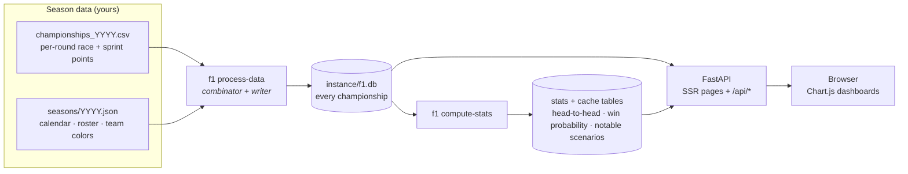
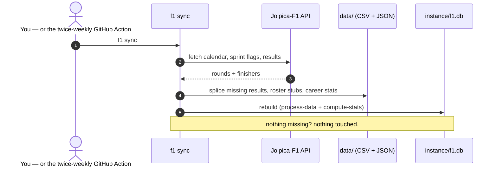
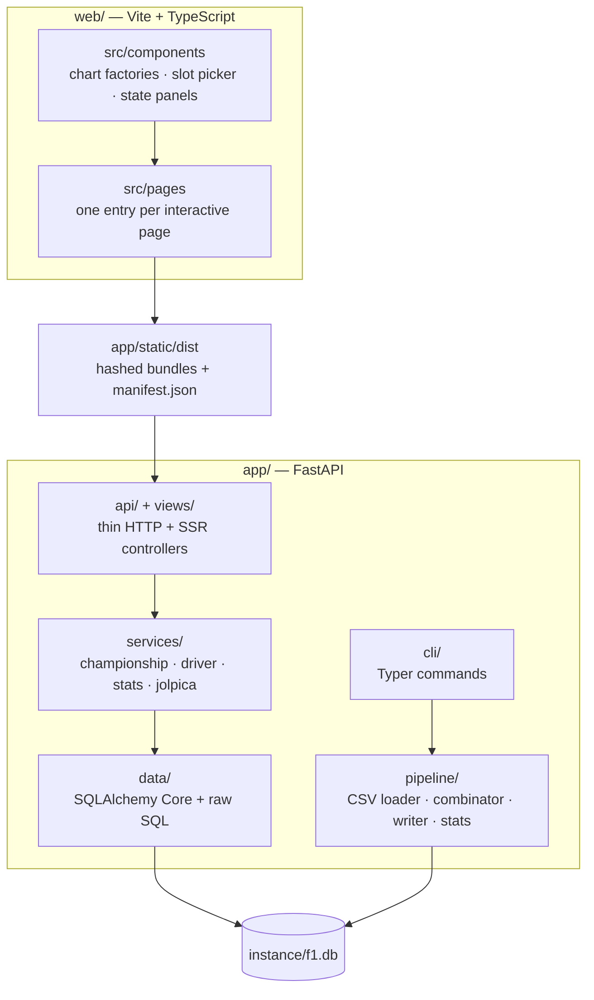

<div align="center">

# 🏎️ F1 Season Calculator

**Explore every "what-if" championship scenario for a Formula 1 season.**

Given per-race points, the calculator enumerates *all* non-empty subsets of rounds —
up to **16,777,215** championships for a 24-race year — and tells you who wins,
by how much, and on which round it was decided.

[](https://github.com/NikoKiru/F1_Season_Calculator/actions/workflows/ci.yml)
[](https://github.com/NikoKiru/F1_Season_Calculator/actions/workflows/data-sync.yml)
[](https://www.python.org/downloads/)
[](https://fastapi.tiangolo.com/)
[](https://vitejs.dev/)
[](https://sqlite.org/)
[](https://github.com/astral-sh/ruff)
[](https://mypy-lang.org/)
[](LICENSE)

[Quick start](#-quick-start) ·
[How it works](#-how-it-works) ·
[Keeping data fresh](#-keeping-a-live-season-current) ·
[CLI](#-cli) ·
[HTTP API](#-http-api) ·
[Changelog](CHANGELOG.md)

</div>

---

## ✨ Features

- **Every possible championship** — the combinator generates all 2ⁿ−1 round
  subsets and scores each one, so you can ask "what if only the sprints
  counted?" or "which single race decides the title?"
- **Notable Scenarios** — a discovery page (Championships ▾ → Notable
  Scenarios, `GET /api/statistics/notable-scenarios`) surfacing the season's
  extremes: the closest title (**Nail-Biter**), the biggest blowout
  (**Demolition**), the longest championship that still crowns a different
  champion (**Against All Odds**), the rarest champion (**Cinderella**), and
  the single most decisive round (**Kingmaker**).
- **One-command data sync** — `f1 sync` pulls the calendar, results, and
  roster from the [Jolpica-F1](https://jolpi.ca) API and rebuilds everything.
  A scheduled GitHub Action does the same twice a week and auto-commits.
- **Sprint-aware data model** — sprint points live in dedicated `{N}s`
  columns and are surfaced separately in the UI.
- **Fast where it counts** — head-to-head and driver-detail pages read from
  precomputed cache tables and answer in under a second instead of
  self-joining hundreds of millions of rows.
- **Modern stack** — FastAPI + SQLAlchemy Core + SQLite backend with OpenAPI
  docs at `/api/docs`; Jinja2 SSR + Vite + TypeScript frontend with
  Chart.js loaded only on pages that need it; a Typer CLI (`f1 …`) for the
  whole data lifecycle; unit, API-contract, and Playwright e2e test suites.

## 🚀 Quick start

**Prerequisites:** [Python 3.10+](https://www.python.org/downloads/) (tested
on 3.10 – 3.13) and [Node.js 18+](https://nodejs.org/) for the Vite frontend
(`pnpm`/`yarn` also work with the `package.json` scripts).

```bash
# 1. Clone and install (editable)
git clone https://github.com/NikoKiru/F1_Season_Calculator.git
cd F1_Season_Calculator
python -m venv .venv
# Windows: .venv\Scripts\Activate.ps1    Linux/Mac: source .venv/bin/activate
pip install -e .

# 2. Scaffold folders + empty DB + sample CSV
f1 setup

# 3. Point it at a season (2026 ships with starter data)
f1 process-data --season 2026
f1 compute-stats --season 2026

# 4. Build frontend assets (once; use `npm run dev` for watch mode)
cd web && npm install && npm run build && cd ..

# 5. Serve
uvicorn "app.main:create_app" --factory --host 127.0.0.1 --port 8000 --reload
```

Open <http://127.0.0.1:8000> — interactive API docs live at `/api/docs`.

> [!TIP]
> The `f1` script is registered by `pip install -e .`. If your shell can't
> find it after install, reopen the terminal so the new `Scripts/` entry is
> on `PATH`, or run `python -m app.cli …` — it's the exact same Typer app.

## 🧮 How it works

The CSV is the single source of truth for points; the season JSON carries
the calendar, roster, and presentation metadata. Everything else is derived:



See [`data/README.md`](data/README.md) for the exact CSV format, including
the **sprint columns** (`{N}s`) and the 2026 calendar.

## 🔄 Keeping a live season current

```bash
f1 sync
```

That's it. `sync` diffs the local data against the Jolpica-F1 API and fixes
every gap — idempotent, so re-running when up to date touches nothing:



| Flag             | Effect                                                        |
| ---------------- | ------------------------------------------------------------- |
| `--dry-run`      | Show the plan without changing anything                       |
| `--no-reprocess` | Update data files only, skip the rebuild (what CI uses)       |
| `--bio/--no-bio` | Career stats refresh (default: only when new rounds landed)   |
| `--season YYYY`  | Target a specific season                                      |

The scheduled [`data-sync.yml`](.github/workflows/data-sync.yml) workflow
runs `f1 sync --no-reprocess` twice a week and commits any new data, so a
deployment machine only needs `git pull` plus the manager's **Build** (or a
local `f1 sync`). The Tkinter manager (`tools/manage_ui.py`) also has a
one-click **Sync** button.

The older manual paths still work:

```bash
# Manual entry (optional --sprint on sprint weekends)
f1 add-race --season 2026 --race 3 \
  --results "VER:25,NOR:18,LEC:15,PIA:12" \
  --sprint  "VER:8,NOR:7,LEC:6"

# Pull one specific round from Jolpica
f1 fetch-race --season 2026 --round 3
```

### Starting a new season

```bash
f1 new-season --season 2027   # once Jolpica publishes the calendar
f1 sync --season 2027         # then this keeps it current all year
```

Colors, team principals, power units, and championship titles carry over
from the previous season's JSON; the command prints a short checklist of
anything that still needs hand-curation.

### 2026 calendar notes

- Bahrain and Saudi Arabia were canceled; Jolpica renumbered the calendar to
  22 sequential rounds and this repo follows that numbering (round 4 =
  Miami, round 5 = Canada, …).
- **Sprint weekends:** rounds 2 (China), 4 (Miami), 5 (Canada),
  9 (Silverstone), 12 (Zandvoort), 16 (Singapore) — `f1 sync` keeps
  `sprint_rounds` aligned with the API automatically.

## 🧰 CLI

| Command                                                              | Description                                                                                 |
| -------------------------------------------------------------------- | ------------------------------------------------------------------------------------------- |
| `f1 sync [--season YYYY] [--dry-run]`                                 | **Bring a season fully up to date from the API** (calendar, results, roster, bios, rebuild) |
| `f1 new-season --season YYYY`                                         | Scaffold `seasons/{YYYY}.json` from the API with carry-over from last year                  |
| `f1 setup`                                                            | Create `data/`, `instance/`, sample CSV, empty DB                                           |
| `f1 process-data --season YYYY`                                       | Generate all championships from CSV                                                         |
| `f1 compute-stats --season YYYY`                                      | Pre-compute driver statistics + win probability cache                                       |
| `f1 add-race --season YYYY --race N --results "…" [--sprint "…"]`     | Append a weekend's results                                                                  |
| `f1 fetch-race --season YYYY --round N [--no-reprocess]`              | Pull race + sprint from Jolpica and splice in                                               |
| `f1 refresh-bio --season YYYY`                                        | Top up career totals + palmarès (skips the write when nothing changed)                      |

## 🌐 HTTP API

The REST surface lives under `/api/*` — full schema at `/api/openapi.json`,
interactive docs at `/api/docs`. Highlights:

| Endpoint                                     | Purpose                                                          |
| -------------------------------------------- | ---------------------------------------------------------------- |
| `GET /api/championships`                     | Paginated championship list                                      |
| `GET /api/championships/{id}`                | Full detail incl. per-round race/sprint points                   |
| `GET /api/championships/wins`                | Wins per driver                                                  |
| `GET /api/championships/min-races-to-win`    | Fewest rounds needed to win per driver                           |
| `GET /api/drivers/{code}/stats`              | Consolidated driver stats (one query)                            |
| `GET /api/drivers/{code}/position/{n}`       | Paginated scenarios where driver finished Pn                     |
| `GET /api/drivers/head-to-head/{a}/{b}`      | Win/loss split between two drivers                               |
| `GET /api/drivers/highest-position`          | Each driver's best-ever finish                                   |
| `GET /api/drivers/positions?position=N`      | Share of scenarios per driver at position N                      |
| `GET /api/statistics/win-probability`        | Win probability by season length                                 |
| `GET /api/statistics/notable-scenarios`      | Curated "most extreme" what-if championships                     |
| `GET /api/search/championship?rounds=1,2,3`  | Look up a championship by rounds                                 |

## 🏗️ Architecture



```
app/                     FastAPI backend
├── main.py              App factory
├── api/                 HTTP routers (thin, delegate to services)
├── views/               SSR page controllers
├── services/            Business logic — championship, driver, stats, jolpica
├── domain/              Pydantic models
├── data/                SQLAlchemy engine + raw SQL
├── pipeline/            CSV loader, combinator, writer, stats compute
├── cli/                 Typer commands (setup, process-data, sync, …)
├── cache/               In-memory cache service
└── templates/           Jinja2 templates (SSR)

web/                     Frontend source
├── src/pages/           One TS entry per interactive page
├── src/components/      Shared chart factories, slot picker, state panels
├── src/styles/          Design tokens + component CSS
└── vite.config.ts       Multi-entry build → app/static/dist/

data/                    Your CSV + season JSON (user data)
instance/                SQLite file
tests/                   unit/ + api/ + e2e/
```

## 🖥️ Frontend development

The `web/` directory is a standard Vite + TypeScript project. From inside it:

| Command             | What it does                                                  |
| ------------------- | ------------------------------------------------------------- |
| `npm install`       | Install frontend dependencies                                 |
| `npm run build`     | One-off production build → `app/static/dist/`                 |
| `npm run dev`       | Vite dev server with HMR (run alongside `uvicorn --reload`)   |
| `npm run typecheck` | `tsc --noEmit`                                                |

FastAPI reads `app/static/dist/manifest.json` at startup to resolve hashed
asset URLs, so rebuild after changing any TS/CSS file (or leave
`npm run dev` running).

## 🧪 Tests

```bash
pytest                           # unit + API contract (~2s)
pytest tests/e2e                 # Playwright (auto-skips if not installed)
```

Coverage is checked in CI; unit tests use a seeded in-memory SQLite DB built
by the real pipeline, so they exercise CSV loader → combinator → writer →
services end-to-end.

## 🤝 Contributing

Recent changes live in the [CHANGELOG](CHANGELOG.md); development
conventions in [CONTRIBUTING.md](CONTRIBUTING.md). Linting is
[Ruff](https://github.com/astral-sh/ruff) (including import sorting) and
typing is `mypy --strict`.

## 📄 License

MIT — see [LICENSE](LICENSE).

## 🙏 Acknowledgments

- [Jolpica-F1](https://jolpi.ca) — the Ergast successor API this project
  uses for race results.
- [ChainBear](https://www.youtube.com/@ChainBear) for the original
  "what if only these races counted?" F1 analysis format.
